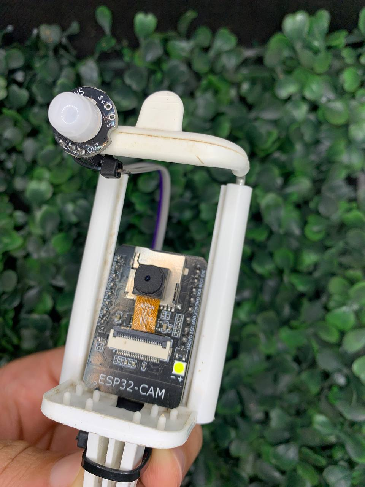

# ESP32-CAM Motion-Activated Photo Capture with Telegram Integration

This project uses an ESP32-CAM module, a PIR motion sensor, and a Telegram bot to create a motion-activated photo capture system, allowing for remote monitoring of environments.

## Components Used

- **ESP32-CAM**: A camera module based on the ESP32, equipped with a 2MP OV2640 camera, Wi-Fi and Bluetooth support, and a microSD card slot.

- **ESP32-CAM-MB**: A USB to serial adapter that facilitates programming and communication with the ESP32-CAM.

- **PIR Sensor (Passive Infrared)**: A device that detects motion by measuring changes in infrared levels emitted by nearby objects. Used to trigger photo capture when motion is detected.

## Project Functionality

1. **Motion Detection**: The PIR sensor monitors the environment and, upon detecting motion, sends a signal to the ESP32-CAM.

2. **Photo Capture**: After receiving the signal from the PIR sensor, the ESP32-CAM captures a photo and sends it to the selected chat.

3. **Telegram Sending**: The ESP32-CAM is configured with a Telegram bot, allowing it to respond with photos or sensor status information when certain commands are sent.

## Configuration and Programming

- **Connections**: The PIR sensor should be connected to the ESP32-CAM by linking the sensor's output pin to GPIO 12 on the ESP32-CAM.

- **Software**: The ESP32-CAM source code should include the necessary libraries for the camera, PIR sensor, and Telegram communication. It is important to properly configure the variables in `env.cpp`.

## Additional Considerations

- **Power Supply**: The ESP32-CAM can be powered via USB through the ESP32-CAM-MB or by an appropriate external power source.

**Note**: This project involves aspects of security and privacy. Be sure to use it in accordance with applicable laws and regulations in your region.
